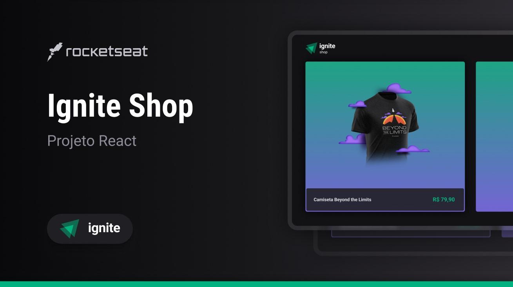

# Ignite Shop

Projeto educacional pelo curso da [@Rocketseat](https://www.rocketseat.com.br/)

### Sobre

Uma loja virtual que se integra com uma API de Ecommerce da empresa [Stripe](https://stripe.com/en-br).

### Estrutura

- Projeto criado em React com o framework [NextJs](https://nextjs.org/).
- A estrutura visual é feita com [Stitches](https://stitches.dev/), ferramenta de CSS-in-JS.
- Neste projeto tambem aplico conceitos de SSR (Server Side Rendering) e SSG (Static Site Generator).

### Para Rodar o Projeto

- Crie uma conta na Stripe e faça um projeto de ecommerce com os devidos produtos.
- Clone esse repositório
- Acesse a pasta dele
- Instale as dependencias com `npm i`
- Na raiz do projeto crie um arquivo `.env.local`
- E utilize o arquivo `.env.example` para se basear na configuração
- E enfim rode o projeto com `npm run dev`

> obs: no arquivo `./src/lib/stripe.ts` tem que colocar o nome do projeto conforme cadastrado na plataforma do stripe.
